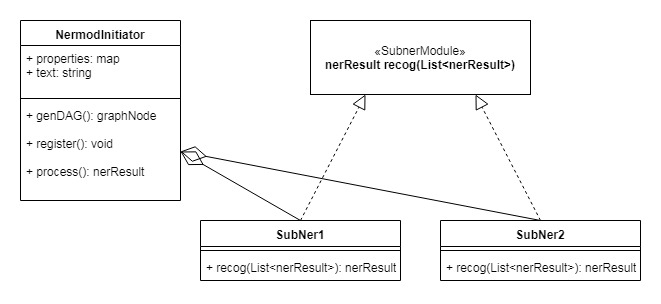
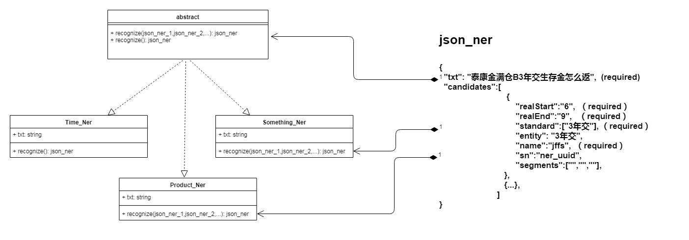

## Ner 模块说明
### 1. 整体框架
本节描述整个NER大模块的框架，
#### a.未来在labrador_algo的框架,如下图


#### b.当前python实现的框架,如下图:



1. 各个NER模块实现统一的接口（或者叫继承自同一个抽象类）；
2. 各个NER模块可以依赖其他NER模块的识别结果(NER_JSON)

NER_JSON
```
{ 
  "txt": "泰康金满仓B3年交生存金怎么返",  (required)
  "candidates":[
    {
        "realStart":"6",  （required）
        "realEnd":"9",   （required）
        "standard":["3年交"], （required）
        "entity": "3年交",  
        "name":"jffs",  （required）
        "sn":"ner_uuid", 
        "segments":["","",""],
    },
    
    {...},
    
 ]
}
```

required标记的字段被认为是必须的，其他字段有些是未来可能会被用到的，也有为了debug输出的信息。

required标记的字段大体要表达的意思是某个NER模块将txt的文本从realStart到realEnd(不包含)切分成一个词，并将其打上name指代的标记信息，而这个词对应的标准词由standard字段列出。

### 2. 产品识别模块 (product_ner)

#### 2.1 目标
产品识别模块作为大框架中的一个子模块用于识别泰康人寿保险产品。
#### 2.2 实现
1. 思路
   
   在观察了泰康952的产品列表后，发现标准产品名是基于一个类似“幸福人生”的kernel词，再加上一些标识所属（“泰康”）、标识类型（“A款”）、标识功能（“两全”）以及标识结束（“保险”）的一些限定词构成的。别名是基于此变化而来，但kernel词在别名中基本会出现。因此，产生了基于kernel词向句尾或句首连续发现产品名组成部分进而识别出产品名的想法。

   这个思路是基于分词的办法，因此，在识别出产品名完成链接到标准词上的任务时，可以很自然利用产品名中的分词作为filter去筛选整个产品名列表，筛选剩下的词就是所有链接的标准词。
2. 实现
   
   首先，实现这样的思路，需要各种词表，例如 kernel,prefix,suffix,limited等。
   
   a.) kernel:   kernel词满足
   
       1）直觉上，在产品列表中具有很大区分度的词，例如，“卓越财富”只会出现在卓越财富系列的保险产品中，这要比“意外伤害”要更能区分是哪个保险；
   
       2）在别名中也基本会出现的词；
       例如，在"泰康卓越财富2007终身寿险（万能型）" 的别名列表中:"卓越财富2007终身寿险（万能型）,卓越财富2007终身寿险万能型,泰康卓越财富2007,卓越财富2007终身寿险（万能险）保险,泰康卓越财富2007终身寿险（万能险）保险,泰康卓越财富终身寿险,卓越财富(2007)终身寿险（万能险）,卓越财富2007,泰康卓越财富2007（万能险）..." , 卓越财富是必不可少的，因此，它可以定义为一个kernel词


   b.) prefix: 只会出现在词首的词；
       
       例如: 泰康、泰、康等

   c.) suffix: 只会出现在词尾的词；

       例如: 保险、保、险、寿险、医疗险等

   d.) limited: 可能出现词首、词中、词尾的词；

       例如：分红型、终身、A款等

   其次，将这些词组织成词表，利用分词工具进行分词，为确保分词结果达到预期，还会对分词结果进行微调；
   
   在完成以上步骤时，此发现产品名的算法就变成了连续词的搜索，一旦遇到集外的词就停止搜索。搜索策略如下：

        1） 能找到kernel词的情况，从kernel词向词首找在 prefix+limited 集合中的词的连续序列；从kernel词向词尾找在 suffix+limited 集合中的词的连续序列；

        2） 在不能找到kernel词的情况，去寻找prefix+limited+suffix的词的连续序列

        循环此过程直至句尾，可发现句中所有可能的产品名。

   最后，把找到的产品名的分词结果当作filter，不断筛选标准产品名全集，最终得到的集合就是识别出的产品名对应的标准名。
3. 流程演示
   
   prefix = ["泰康","泰","康"]

   suffix = ["保险"]

   limited = ["分红型","A款"]

   kernel = ["卓越财富"]

   standard = ["泰康卓越财富A款分红型保险","泰康卓越财富A款万能型保险"]
   
   query = "泰康卓越财富A款分红型的交费方式"
   
   整个流程如下：

   1） 分词

      泰康/卓越财富/A款/分红型/的/交费方式
    
   2） 搜索
      
      查找kernel词"卓越财富"，向词首搜索，逐一找到 prefix + limited中的词，到句首，只找到"泰康";向词尾搜索，逐一找到 limited + suffix中的词，分别是"A款"、"分红型"，发现"的"不在limited+suffix中，停止。最终找到产品名"泰康/卓越财富/A款/分红型"
    
    3） 实体链接
      
      依据识别出的产品名的分词结果"泰康/卓越财富/A款/分红型"去筛选standard，最终得到"泰康卓越财富A款分红型保险"
#### 2.3 维护
对于kernel、prefix、suffix、limited词表还无法做到自动维护，还只能依赖人力。大体上，按照上述给出的定义，将新遇到的产品名分词将不同部分加入到对应词表中即可。

kernel、prefix、suffix、limited词表的文件格式，均是"每行一个词，忽略空白行和#开头的行"

值得注意的是，在初期整理的时候，limited中每个词是带tag的，例如: "个险  media"、"网销  media"，但在实际实现中未使用这些信息，但在未来可能会用上，实际使用的是limited-1这个词表，只是少了tag,例如: "个险"、"网销"。还有基于正则的regex-limited表，如"[A-Za-z]款{0,1}  terms"，实际使用的regex-limited-1表也只是少了tag，例如: "[A-Za-z]款{0,1}"。

除此之外，还会维护一些小的词表，或正则表达式，它们是做后处理的，是提升算法准确性的trick。


ambiguous_prefix: 在识别出的一个词中，如果前缀是这个词，那么都有它或没它的产品名都被视作可能的情况，例如，对于"附加"这个词，附加泰康卓越财富保险的交费方式 --> 附加泰康卓越财富保险, 泰康幸福人生保险可以附加泰康卓越财富保险吗？ --> 泰康卓越财富保险。

ambiguous_suffix: 在识别出的一个词中，如果后缀是这个词，那么都有它或没它的产品名都被视作可能的情况，例如，对于"身故"这个词，祥云康顺身故的交费方式 --> 祥云康顺身故, 泰康幸福人生身故了怎么赔付？ --> 泰康幸福人生。

对于后缀词的前一个词或后一个词很大程度上决定了当前这个后缀词是否应该是后缀，基于此理由，有了如下的词表或者正则

tail_minus_one_and_tail_cut_tail_pattern: 正则，后缀词前一个词和后缀词满足此正则，会把后缀词去掉，例如: 泰康祥云保险重大疾病怎么保? 按照算法，会识别出"泰康祥云保险重大疾病",但明显这个应该是"泰康祥云保险"。

tail_minus_one_and_tail_stop_pattern: 正则,后缀词前一个词和后缀词满足此正则，会把后缀词和后缀词前一个全部去掉，例如： 泰康祥云保重大疾病吗? 按照算法，会识别出"泰康祥云保重大疾病",但明显这个应该是"泰康祥云"。

tail_plus_one_patterns: 正则，后缀词和后缀词后一个词满足此正则，会把后缀词去掉，例如： 泰康祥云保什么吗? 按照算法，会识别出"泰康祥云保",但明显这个应该是"泰康祥云"。

#### 2.4 现状与改进

1. 现状
   
   a)  可以完成此算法描述的任务，基于kernel词的产品名以及或者无kernel词的产品名；
   
   b)  对于连续出现的多个kernel词，其中每个词都在kernel词表中，这个连续的kernel词序列不在kernel词表中，目前会将其加入到识别结果中

   c)  在目前的NER框架下，可以通过ner_json将某个词人为指定加入到某个词表中，使算法可以工作。
2. 改进
   
   未来也许通过其他NER模块自动识别这个产品识别模块所需要的词并将其加入对应词表，减轻人工的工作。比如，kernel词的识别等。